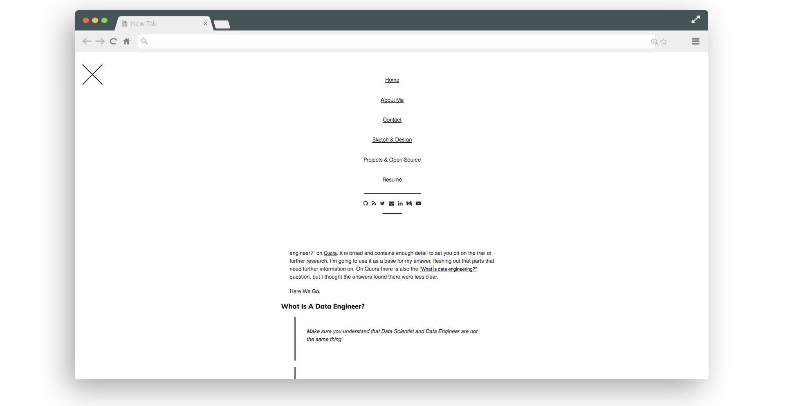
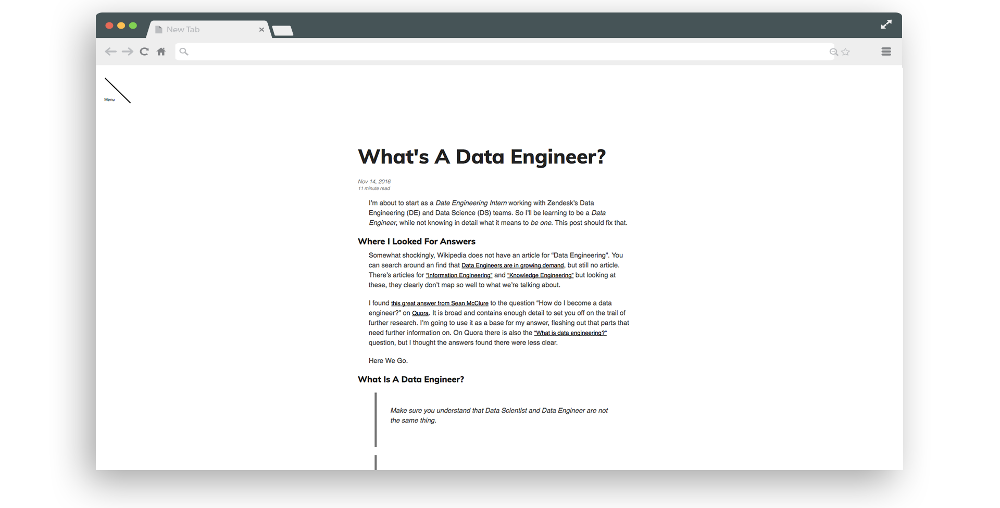
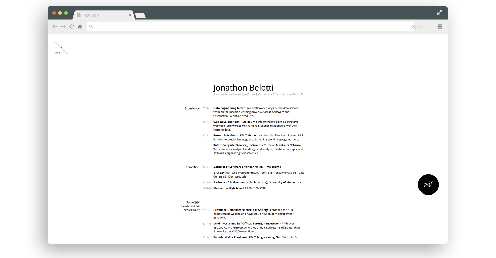
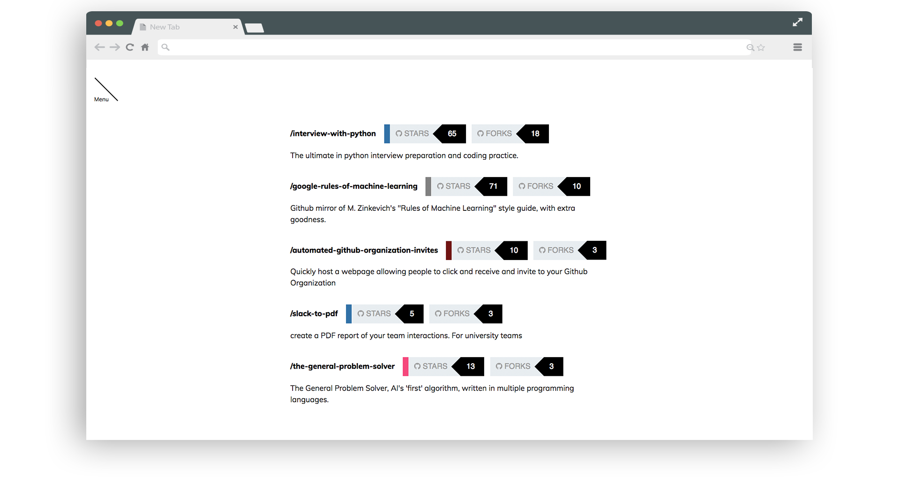
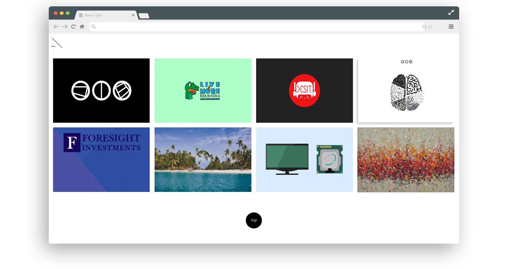
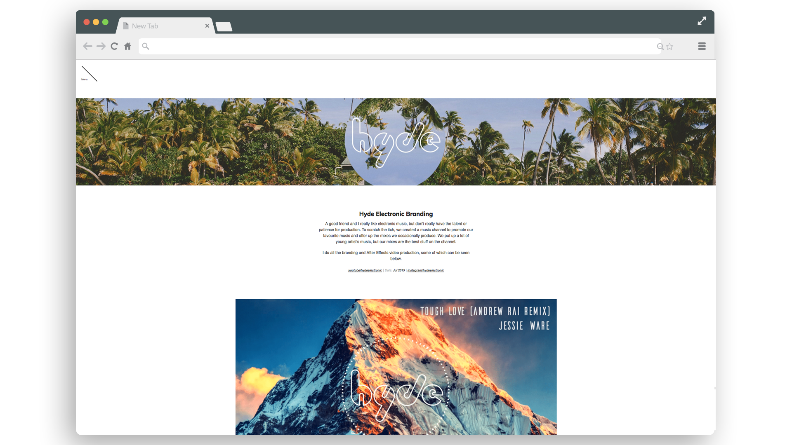
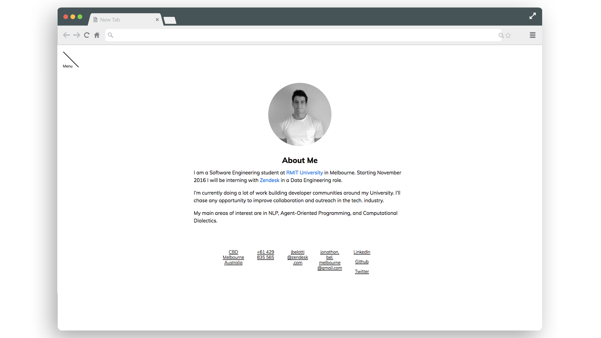
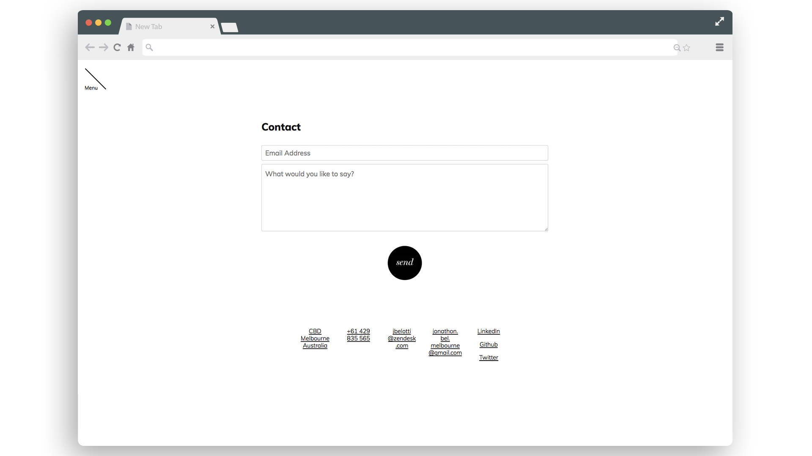

<p align="center">
  
</p>

# Junior
-----

*Junior* is a blog/portfolio theme for [Jekyll](http://jekyllrb.com), the static site generator. It's designed and developed by [@jonobelotti_IO](https://twitter.com/jonobelotti_IO).


See Junior in action with [the demo site](https://juniortheme.live).

## Contents

- [Features](#features)
- [Preview](#preview)
- [Usage](#usage)
- [Options](#options)
  - [Rems, `font-size`, and scaling](#rems-font-size-and-scaling)
- [Development](#development)
- [Author](#author)
- [License](#license)

## Features

- Blog/Technical posts, with support for code syntax highlighting, `LaTeX` markup, images, footnotes, and font color-highlighting
- 'Portfolio' section, which emphasises large-image content
- Markdown resumé, with support for fast and easy PDF printing
- Connects to your Github profile via their API, in order to display open-source work
- RSS Feed
- Contact page, with anti-spam protection
- Smooth CSS transition elements, and a nice B&W theme

## Preview

> **Note:** These images may be outdated. See http://juniortheme.live/ for latest version of theme

##### Landing Page


##### Dropdown Menu



##### Example Blog Post



##### Resumé

Attractive, no-fuss resumé page that includes a PDF-print link (right) with CSS configured to ensure fidelity between screen and paper page.



##### Open Source Showcase

Connects, using Github's API, with your public profile and pulls your projects (ordered by Stars). Coming soon, you will also be able to showcase significant PRs. *Tag colours are also matched to the project's Github language colour-coding.*



##### Project Portfolio Visual Showcase



##### Project Page



##### About



##### Contact



## Usage

### 1. Install dependencies

Poole is built on Jekyll and uses its built-in SCSS compiler to generate our CSS. Before getting started, you'll need to install the Jekyll gem:

```bash
$ gem install jekyll
```

**Windows users:** Windows users have a bit more work to do, but luckily [@juthilo](https://github.com/juthilo) has your back with his [Run Jekyll on Windows](https://github.com/juthilo/run-jekyll-on-windows) guide.

**Need syntax highlighting?** *Junior* includes support for Pygments or Rouge, so install your gem of choice to make use of the built-in styling. Read more about this [in the Jekyll docs](http://jekyllrb.com/docs/templates/#code_snippet_highlighting).

### 2a. Quick start

To help anyone with any level of familiarity with Jekyll quickly get started, *Junior* includes everything you need for a basic Jekyll site. To that end, just download *Junior* and start up Jekyll.

### 2b. Roll your own Jekyll site

Folks wishing to use Jekyll's templates and styles can do so with a little bit of manual labor. Download *Junior* and then copy what you need (likely `_layouts/`, `*.html` files, `atom.xml` for RSS, and `public/` for CSS, JS, etc.).

### 3. Running locally

To see your Jekyll site with *Junior* applied, start a Jekyll server. In Terminal, from `/junior-theme` (or whatever your Jekyll site's root directory is named):

```bash
> jekyll serve # You might need "bundle exec jekyll serve"
```
Open <http://localhost:4000> in your browser, and voilà.

### 4. Serving it up

If you host your code on GitHub, you can use [GitHub Pages](https://pages.github.com) to host your project.

1. Fork this repo and switch to the `gh-pages` branch.
  1. If you're [using a custom domain name](https://help.github.com/articles/setting-up-a-custom-domain-with-github-pages), modify the `CNAME` file to point to your new domain.
  2. If you're not using a custom domain name, **modify the `baseurl` in `_config.yml`** to point to your GitHub Pages URL. Example: for a repo at `github.com/username/junior`, use `http://username.github.io/junior/`. **Be sure to include the trailing slash.**
3. Done! Head to your GitHub Pages URL or custom domain.

No matter your production or hosting setup, be sure to verify the `baseurl` option file and `CNAME` settings. Not applying this correctly can mean broken styles on your site.

## Options

### Google Analytics

In `_config.yml` the option `google_analytics:` is left blank if you don't want to use Google Analytics. Add `true` if you want to use it, and replace `[[[TRACKING ID HERE]]]` with your "Tracking ID". You can get one of those for your new site [here](https://www.google.com/analytics). 


### Rems, `font-size`, and scaling

*Junior* is built almost entirely with `rem`s (instead of pixels). `rem`s are like `em`s, but instead of building on the immediate parent's `font-size`, they build on the root element, `<html>`.

By default, we use the following:

```css
html {
  font-size: 16px;
  line-height: 1.5;
}
@media (min-width: 38em) {
  html {
    font-size: 20px;
  }
}

```

To easily scale your site's typography and components, simply customize the base `font-size`s here.


## Development

*Junior* has two branches, but only one is used for active development.

- `master` for development.  **All pull requests should be to submitted against `master`. Cheers**
- `gh-pages` for the hosted site, which includes analytics tracking code. **Please avoid using this branch.**

CSS is handled via Jeykll's built-in Sass compiler. Source Sass files are located in `_sass/`, included into `styles.scss`, and compile to `styles.css`.

#### Running 

`bundle exec jekyll serve`

## Credit

* [Pixyll theme](https://github.com/johnotander/pixyll) was used as a base for development of this theme.
* [Junior.IO's](http://www.junior.io/) website design served as inspiration for this theme's look.

## License

Open sourced under the [MIT license](LICENSE).
